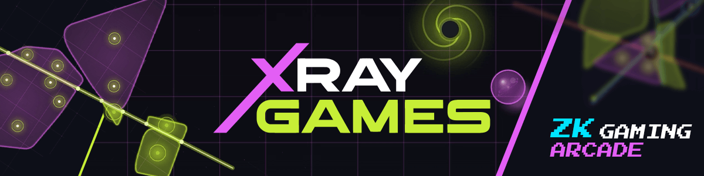
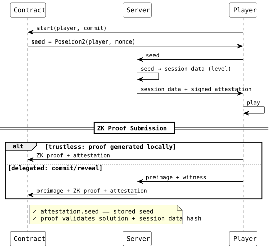

[](/LICENSE)


<p align="center">
  <a href="https://xray.games">
    
  </a>
</p>
<p align="center">
  <a href="https://xray.games">Play Now</a> ·
  <a href="https://kyungj.in/posts/trustless-gaming-stellar-xray-games/">Read the Blog</a>
</p>

# xray-games

This repository contains the engine room behind [xray.games](https://xray.games), a trustless arcade where player skill is proven entirely onchain.

Traditional zero-knowledge circuits typically focus on proving low-cost, tractable statements with known upper bounds (hash preimages, range checks, Merkle inclusion) where circuit shape is predictable.

The ZK circuits and contracts behind xray.games solve a different class of problem where the computational structure is dynamic, recursive, heavily shaped by player input from arbitrary polygon partitioning, edge-boundary containment, object physics, level integrity checks.

Gaming has historically pushed technical boundaries, but most computation-heavy workloads remain impractical onchain due to execution costs. Stellar's [X-Ray protocol](https://stellar.org/blog/developers/announcing-stellar-x-ray-protocol-25) changes that equation, making this class of demanding applications viable onchain — and xray.games puts it into production in a real gaming environment.

All smart contracts and zero-knowledge circuits powering the arcade are open source under the [MIT License](LICENSE). Enjoy.

## Zero-Knowledge Circuits

The circuits are available in both Noir (w/ Poseidon2) and Circom (2.1.9 w/ circomlib Poseidon and comparators).

To reduce verification from O(n²) brute-force checking to O(n), the circuits use a hint-based architecture (benefiting Noir more than Circom), slightly increasing the prover complexity but shrinking the compiled circuit from ~100MB to ~4MB. [Read more on my blog](https://kyungj.in/posts/trustless-gaming-stellar-xray-games/).

| Backend | Constraints/Width | Compiled Size |
|---------|-------------------|---------------|
| Circom  | 458,578           | 3.5MB         |
| Noir    | 273,511           | 4.3MB         |

Stellar natively supports BN254 pairings for Groth16, enabling full onchain verification of Circom proofs. Noir is more constraint-efficient for this workload, but currently lacks native support on Stellar. An alternative path would be integrating an external verifier such as [ultrahonk_soroban_contract](https://github.com/indextree/ultrahonk_soroban_contract).

## Session Lifecycle & Trust Model

Poseidon2-seeded deterministic sessions with dual ZK proof submission paths: direct trustless or server-delegated with commit/reveal.



No oracles or server-side validation is required. In xray.games, the server is a convenience layer, not a trust assumption. Players can either delegate proof generation and submission to the server, or download the prover, generate proofs locally, and submit directly to the contract.

## Ohloss Integration

Games optionally integrate with the [Ohloss protocol](https://github.com/kalepail/ohloss) for faction warfare.

Ohloss design requires synchronous matches which can be impractical for sustaining active gameplay. xray.games contracts implement asynchronous matchmaking, removing the need for scheduling coordination while maintaining the faction rivalry mechanics that make Ohloss engaging.

Not enrolled yet? Pick a faction. [Go represent](https://ohloss.com)!

## Building

For contracts:
```bash
stellar contract build
```

For the Circom circuits:
```bash
circom <circuit> --r1cs --wasm --sym
# example: circom slicer.circom --r1cs --wasm --sym
```

For the Noir circuits:
```bash
nargo compile --package <package name>
# example: nargo compile --package slicer
```

## Mainnet Contracts

| Contract | Address |
|----------|---------|
| Chain Slicer | `CD4XBH2QTIYJYGFEF6PGXPDL7HQRB2SL5Z2CHPJZMRCHMUHXH7J7YOLT` |
| Chain Snooker | `CBLPDJAKIDUSFUYTVI25HTR6G64J5NOMCVWEOAKW4DOLABJDZMYK4ZXJ` |
| Chain Runner | `CATJOAEWORAGHR5ANI5GOKXVJGM75OW73QZ7UUL25PTPQW3V5WFBJEQM` |

Admin: `GDMS6MPSI7DKP4VRZ4NK6LHFWUJ4QAHZ3VO22NYCKBLNOBSWDANGGAME`

## License

[MIT](LICENSE)